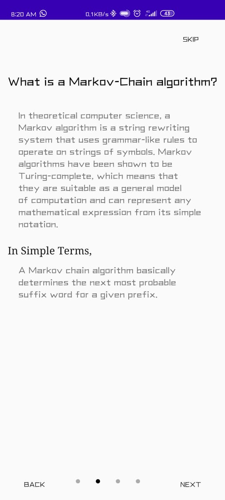
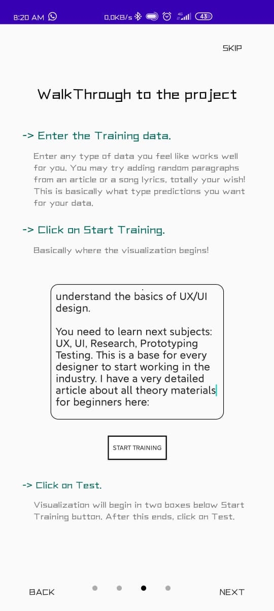
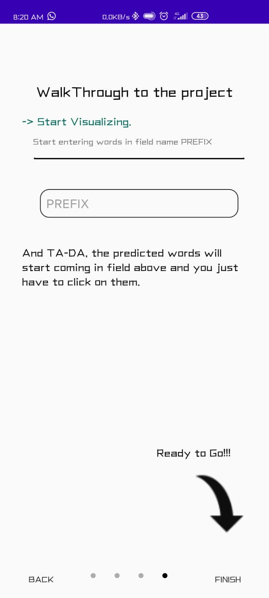

# Markov-Chain-Visualiser
Welcome to Markov Chain Algorithm visualiser!!  

## All about Markov-Chain-Visualiser
- It helps in understanding, the working of Markov's Algorithm.
- A Tutorial Sheet has been attached at the beginning for basic understanding.
- It works on a large dataset which the user's can give at the beginning and train the model.
- It uses the Markov's algorithm to work and give results based on the dataset with which the model has been trained.
- User can test the model by typing words or even paragraphs and a suggession box will appear and will show various words that can be replaced with the current word and can even give suggessions for future words.

## Markov's Algorithm
- Markov's Algorithm is usually used in Data Science but we have converted it in Kotlin to showcase it in our application.
- Markov's Algorithm is a string rewriting system that uses grammar-like rules to operate on strings of symbols.

## TUTORIAL-SHEET DISPLAY
<kbd></kbd>
<kbd></kbd>
<kbd></kbd>
